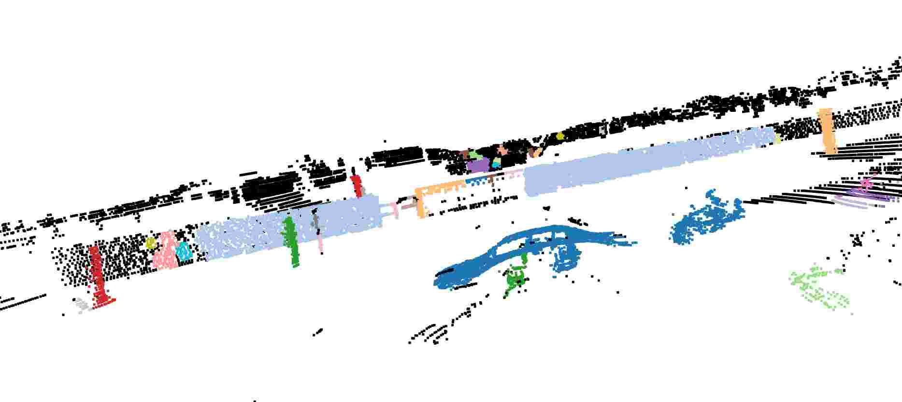

# cornercases_detection

Python implementation of the paper:
- 'CODA: A Real-World Road Corner Case Dataset for Object Detection in Autonomous Driving'([link](https://arxiv.org/pdf/2203.07724.pdf))

Point cloud segmentation algorithem is inspired by the paper:
- 'Fast Range Image-Based Segmentation of Sparse 3D Laser Scans for Online Operation'([link](http://www.ipb.uni-bonn.de/pdfs/bogoslavskyi16iros.pdf))
- code in python ([link](https://github.com/Likarian/python-pointcloud-clustering))

## Requirements
- Python 3.9.13
- PyTorch 1.10.2
- Numpy 1.23.3 
- Open3d 0.15.1
- Matplotlib 3.6.0

## Pipeline
### 1.Point Clustering
- Preprocessing(PCD downsample and outerliner removing etc.)
- Ground removal (RanSac)
- Clustering

The goals for this step are:
1.Transform the point cloud file form. The point cloud files in KITTI are changed from .bin to .npy range image or changing .pcd file to .npy range image.
2.Preprocessing.

#### The first step result

### 2.Semantic Segmentation
### 3.Object Detection

## Quick Start
### Available Point Cloud Segmentation Algorithem
- Fast Range
- DbSCAN

